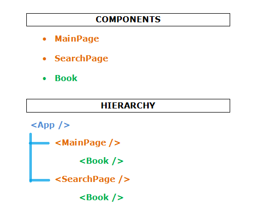
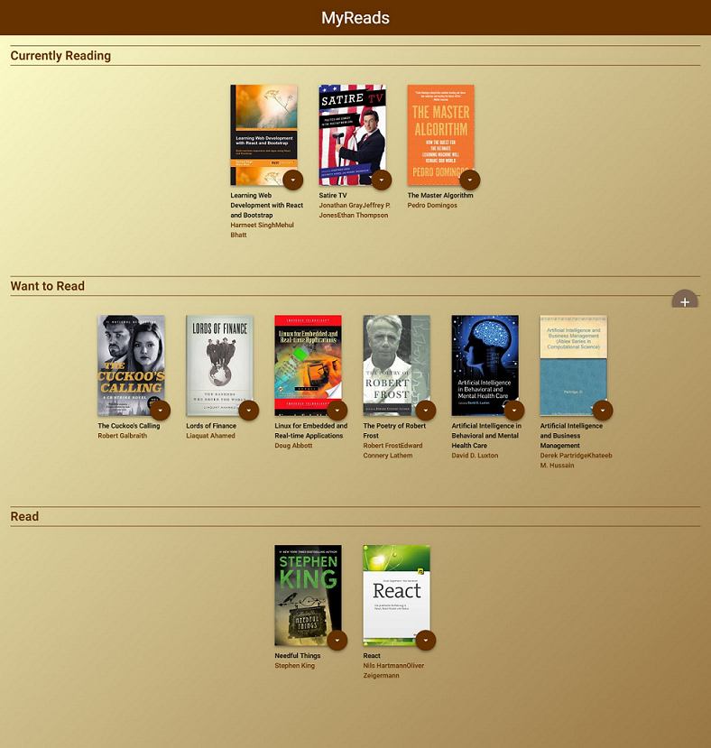
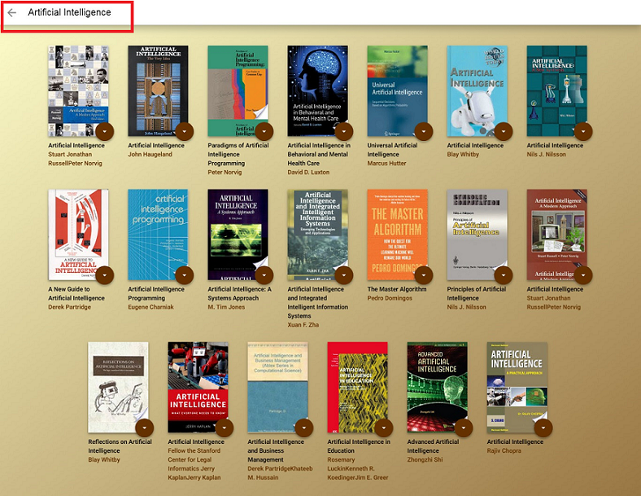

# MyReads Project

# Table of Contents

* [Overview](#overview)
* [Specification](#specification)
* [How to run the project](#how-to-run-the-project)
* [Important](#important)
* [App Functionality](#app-functionality)
* [Credits & Helpful Links](#credits-&-helpful-links)
* [Screenshots](#screenshots)

## Overview

In the MyReads project, I created a bookshelf app that allows the user to select and categorize books they have read, are currently reading, or want to read. The project emphasizes using React to build the application and provides an API server and client library that I used to persist information as the user interacts with the application.

## Specification

As a starting point, I was given a starter static template without any of the React code that was needed to complete the project. My job was be to add interactivity to the app by refactoring the static code in this template.

## How to run the project

To run the project, download or clone the repository in your computer:

    $ git clone https://github.com/dimikara/react-my-reads.git

and follow the instructions below.

In the repository folder: 
* install all project dependencies with 

        npm install
* start the development server with 

        npm start

Please note that the backend server -against which the web app was developped- was provided by Udacity. The provided file [`BooksAPI.js`](src/BooksAPI.js) contains the methods I used to perform necessary operations on the backend:

* `getAll`
* `update`
* `search`

For more information on how these methods are used exactly, please refer to the original [Udacity repository](https://github.com/udacity/reactnd-project-myreads-starter).

## App Functionality

In this application, the main page displays a list of "shelves" (i.e. categories), each of which contains a number of books. The three shelves are:
* Currently Reading
* Want to Read
* Read

Each book has a control that lets the user select the shelf for that book. When the user select a different shelf, the book moves there.

The search page has a text input field that may be used to find books. As the value of the text input changes, the books that match that query are displayed on the page, along with a control that lets the user add the book to their library.

## Important

The backend API uses a fixed set of cached search results and is limited to a particular set of search terms, which can be found in [**SEARCH_TERMS.md**](SEARCH_TERMS.md). That list of terms are the **only terms** that will work with the backend, so don't be surprised if your searches for Basket Weaving or Bubble Wrap don't come back with any results.

## Credits & Helpful Links

* Starter code provided by [Udacity](https://github.com/udacity/reactnd-project-myreads-starter).
* [React documentation](https://reactjs.org/), plus the very helpful section: [Thinking in React](https://reactjs.org/docs/thinking-in-react.html).
* [Presentation](https://www.youtube.com/watch?v=i6L2jLHV9j8&feature=youtu.be) by Maeva NAP.
* The project was bootstrapped with [Create React App](https://github.com/facebookincubator/create-react-app). For more information on how to perform common tasks, visit [this page](https://github.com/facebookincubator/create-react-app/blob/master/packages/react-scripts/template/README.md).
* [OnChange event using React JS for drop down.](https://stackoverflow.com/questions/28868071/onchange-event-using-react-js-for-drop-down)
* React Router from [React Training](https://reacttraining.com/react-router/web/example/url-params).
* Favicon generated via [Favicon & App Icon Generator](https://www.favicon-generator.org/).

## Screenshots

* An illustration of the Components I created and the hierarchy followed during building the App.

* A screenshot of the web app home page: 

* A screenshot of the web app search page; showing books that appear when searching for "Artificial Intelligence". 

## Future Amendments

* Creation of one component for each shelf and updating the app accordingly.
* Change the view by updating the css file (add [Bootstrap React](https://reactstrap.github.io/)?).
* Find a way to use the NoSearchResults Component to inform the user when there are no results that match their search query; or maybe use another method for this.
* Deploying the project live in GitHub Pages.
